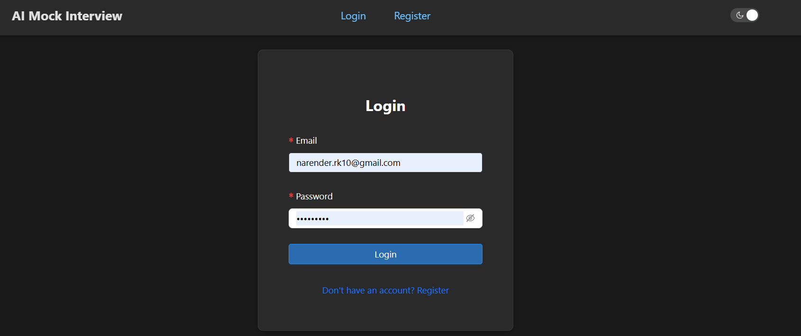
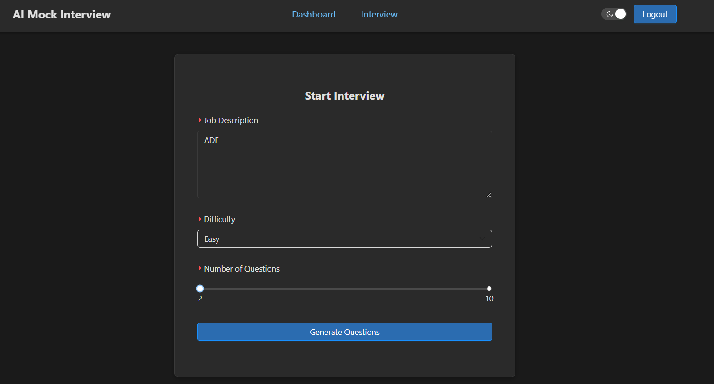
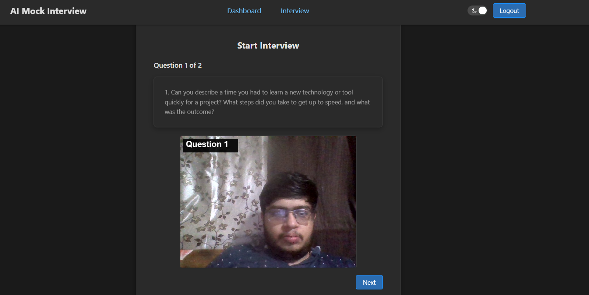
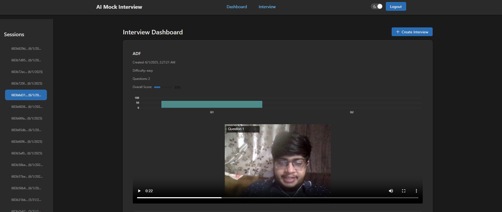
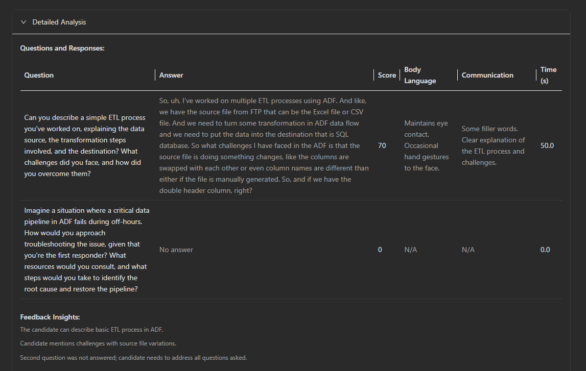
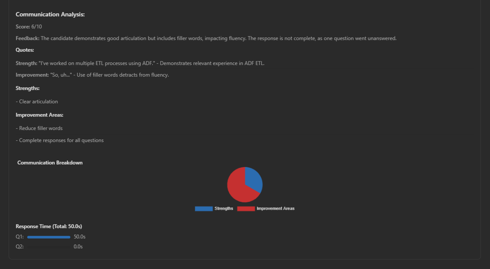

# 🤖  Gen AI Mock Interview Platform

A cutting-edge, AI-powered web application for mock interviews, enabling users to practice job interviews with AI-generated questions and receive detailed video analysis. Built using Google Vertex AI (Gemini-2.0-flash) and FastAPI, it offers realistic question generation, speech-to-text transcription, and performance feedback—ideal for job seekers and interview prep.

---

## 🚀 Features

- Upload job description to generate **tailored interview questions**
- Record video responses with **question overlays** on canvas
- AI-driven **video analysis** with transcription, scoring, and feedback
- Analyzes **body language**, **communication**, and **response clarity**
- Responsive UI with **dark/light mode** support
- View **session history** and analytics in dashboard
- Secure storage with **MongoDB Atlas**

---

## 🖼️ Screenshots








---

## 🛠️ Tech Stack

| 🖥️ Frontend           | ⚙️ Backend       | 🤖 AI & Storage          |
|------------------------|------------------|--------------------------|
| React.js               | FastAPI          | Google Vertex AI         |
| Ant Design (UI Library)| Uvicorn (ASGI)   | Gemini-2.0-flash         |
| Axios (API Calls)      | Python 3.12+     | MongoDB Atlas            |
| React Toastify         | Pydantic         |                          |

---

## ⚙️ Setup Instructions

### 1. Clone the Repo

```bash
git clone https://github.com/narender-rk10/ai-mock-interview.git
cd ai-mock-interview
```

### 2. Setup Backend

```bash
cd backend
pip install requirements.txt
```

Create a `.env` file and add in backend file:

```
MONGODB_URI=
SECRET_KEY=
AWS_ACCESS_KEY_ID=
AWS_SECRET_ACCESS_KEY=
AWS_REGION=
S3_BUCKET_NAME=
GEMINI_API_KEY=
GOOGLE_CLOUD_PROJECT=

```
Create folder credentials inside app\services and add your google credentials json file

Run the server:

```bash
uvicorn app.main:app --reload
```

### 3. Setup Frontend

Create a `.env` file and add in frontend:

```
REACT_APP_API_URL=http://localhost:8000
```

```bash
cd frontend
npm install
npm start
```

Access at `http://localhost:3000`.

---

## 📦 API Endpoints

- **POST `/interview/generate-questions`**  
  - Input: `job_description`, `difficulty`, `num_questions`  
  - Output: List of questions, session ID

- **POST `/interview/upload-video`**  
  - Input: `file` (video), `session_id`  
  - Output: Analysis results

---

## 📁 Project Structure

```
/frontend       # React + Ant Design UI
/backend        # FastAPI + Vertex AI + MongoDB
/screenshots    # UI screenshots
```

---

## 🤝 Contributing

Pull requests are welcome! For major changes, open an issue to discuss. Ensure code follows project style and includes tests.

---

## 📄 LICENSE
<a rel="license" href="http://creativecommons.org/licenses/by-nc-nd/4.0/"></a><br />This work is licensed under a <a rel="license" href="http://creativecommons.org/licenses/by-nc-nd/4.0/">Creative Commons Attribution-NonCommercial-NoDerivatives 4.0 International License</a>.

---

## 🙋‍♂️ Author

**Narender Keswani**  
🔗 [GitHub](https://github.com/narender-rk10) | 💼 [LinkedIn](https://linkedin.com/in/narender-keswani) | 🌐 [Website](https://www.narenderkeswani.com)
